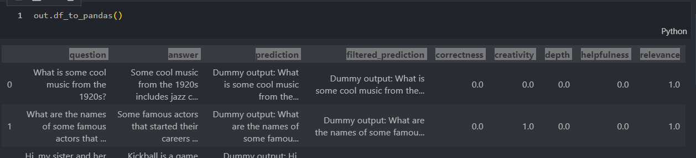

# Module description

### 1. [evaluate.py](evaluate.py)

This module is used to execute the evaluation process using `harness-eval` as the backend with customized templates listed in the [template folder](./template/). Each template is structured following the harness template (or Task) as described in the [documentation](https://github.com/EleutherAI/lm-evaluation-harness/blob/main/docs/task_guide.md).

The `evaluate.py` module serves as a wrapper over [the harness implementation](https://github.com/EleutherAI/lm-evaluation-harness/blob/main/lm_eval/evaluator.py), forcing the use of the Clarifai model and allowing template parameters to be set via method arguments, which is more convenient compared to setting them via a YAML file. This approach is designed to save users from having to read through harness task configuration details, while developers can use it to maintain or expand the codebase.

Other features include:
- Retrieving metric names per template
- Fetching documentation per template
- Accessing configuration per template

#### 1.1. Wrapper
The wrapper is located in `ClarifaiModelHarnessEval.call_harness_eval` method.

```python
results = evaluator.evaluate(
        lm=lm,
        task_dict=task_dict,
        ...
    )
```
where:
* lm: llm model derived from [lm_eval.api.model.LM](https://github.com/EleutherAI/lm-evaluation-harness/blob/main/lm_eval/api/model.py)
* task_dict: Dict of task name and [lm_eval.api.task.Task](https://github.com/EleutherAI/lm-evaluation-harness/blob/main/lm_eval/api/task.py)

#### 1.2. Dataset

Since the initial goal is to evaluate model and dataset uploaded in the platform. The harness-eval consumes hf dataset to run, so we first download Clarifai dataset to temporary file and assign it to harness-eval the config (Task) see [here](https://github.com/Clarifai/clarifai-model-utils/blob/main/clarifai_model_utils/llm_eval/evaluator/harness_eval/evaluate.py)

For now, it also supports huggingface dataset. See this [#6 PR](https://github.com/Clarifai/clarifai-model-utils/pull/6)

### 2. [llm.py](llm.py)

This file contains the implementation of the `Clarifai SDK model/workflow` derived from the harness base model for use in evaluation. It includes two ready components:
- Text model
- RAG workflow

### 3. [judge_llm.py](judge_llm.py)

The `judge_llm.py` module contains the `JudgeLLM` class whose `process` method is inserted into the `process_results` field of templates `llm_as_judge` and `rag`. This allows any judge model to be chosen by providing its URL. You can refer to its usage in [evaluate.py](https://github.com/Clarifai/clarifai-model-utils/blob/main/clarifai_model_utils/llm_eval/evaluator/harness_eval/evaluate.py#L241).

The `process` method takes a row of input dataset and a model output as input arguments, allowing developers to compute the score based on this information.

### 4. [output.py](output.py)

This file contains the `EvaluateResult` class and its components along with utility functions.

**`EvaluateResult` Docstring:**
```yaml
id (str): Evaluation ID
template (str): Template name
dataset (Optional[DatasetInfo]): Dataset information
df (dict): Output dict generated by `harness-eval`, containing input data, predictions, and scores per input. Fields include input df fields, 'prediction', 'filtered_prediction', and metrics of the current template.
summary (dict): Dictionary of metric name and corresponding score
weights (dict): Dictionary of metric name and corresponding weight
llm_judge_info (Optional[LmJudgeInfo]): Judge LLM info
inference_params (dict): Inference parameters used for evaluating the Clarifai model
prompter (Optional[PromptTemplate]): The prompt used for evaluation, replacing the `doc_to_text` field in the template config if set
regex_code (Optional[str]): Regex code used to filter output before evaluation, inserted into the `filter_list` field in the template config if set
timestamp (int): Timestamp when the evaluation was initiated
meta (dict): Arbitrary dictionary
```
Example of `df` in EvaluateResult, see more in [example notebook](./../../../../examples/llm_eval.ipynb)

